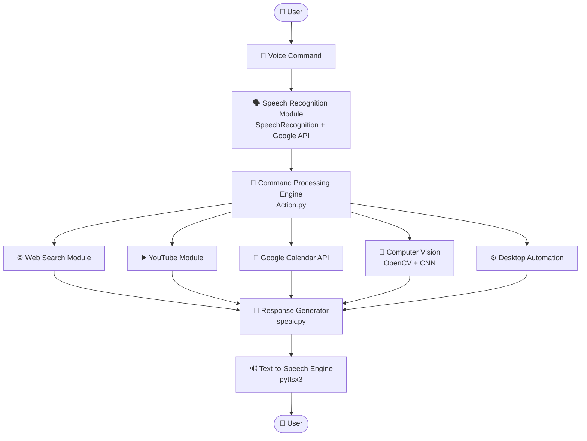

# 🤖 Neura - AI Voice-Controlled Desktop Assistant

Neura is an AI-powered desktop voice assistant developed using Python that enables users to perform everyday computer tasks through natural voice commands.

The assistant integrates **speech recognition**, **computer vision**, **desktop automation**, and **artificial intelligence** to provide a hands-free user experience. Users can perform Google searches, play YouTube videos, manage Google Calendar events, play chess against an AI opponent, and predict age and gender from images.

This project was developed as part of a university academic team project to demonstrate practical applications of **Artificial Intelligence, Computer Vision, Speech Processing, and Human–Computer Interaction**.

---

## ✨ Features

- 🎙 Voice-controlled desktop assistant
- 🔎 Perform Google searches
- ▶️ Play YouTube videos
- 🎵 Play songs using voice commands
- 📅 Add events to Google Calendar
- ♟️ Play Chess against the computer
- 👤 Age prediction from uploaded images or camera
- 🚻 Gender prediction using computer vision
- 🖥️ Desktop automation
- 💬 Voice feedback using Text-to-Speech
- 🧩 Modular architecture for future enhancements

---

## 🏗️ System Architecture



---

## Tech Stack

| Category             | Technologies           |
| -------------------- | ---------------------- |
| Programming Language | Python                 |
| GUI                  | Tkinter                |
| Speech Recognition   | SpeechRecognition      |
| Text-to-Speech       | pyttsx3                |
| Computer Vision      | OpenCV                 |
| Deep Learning        | TensorFlow / Keras     |
| Chess Engine         | python-chess           |
| Automation           | PyAutoGUI              |
| Google Services      | Google Calendar API    |
| Web Services         | Google Search, YouTube |

---

# ⚙️ Installation

## Prerequisites

Before running the project, ensure you have the following installed:

- Python **3.10+** (Recommended: Python 3.10 or 3.11)
- Visual Studio Code (Recommended)

---

## 1️⃣ Clone the Repository

```bash
git clone https://github.com/anmolzehra313/Neura-AI-Desktop-Assistant.git
```

---

## 2️⃣ Navigate to the Project Folder

```bash
cd Neura-AI-Desktop-Assistant
```

---

## 3️⃣ (Optional) Create a Virtual Environment

Windows

```bash
python -m venv venv
venv\Scripts\activate
```

Linux / macOS

```bash
python3 -m venv venv
source venv/bin/activate
```

---

## 4️⃣ Install Required Packages

Install the required libraries:

```bash
pip install SpeechRecognition
pip install pyttsx3
pip install opencv-python
pip install tensorflow
pip install python-chess
pip install pyautogui
pip install google-api-python-client
pip install google-auth
pip install google-auth-oauthlib
pip install google-auth-httplib2
pip install Pillow
pip install pyaudio
```

> **Note:** Installing `PyAudio` on Windows may require downloading a compatible wheel if `pip install pyaudio` fails.

---

## 5️⃣ Google Calendar Configuration

To use the Google Calendar feature:

1. Create a project in Google Cloud Console.
2. Enable the Google Calendar API.
3. Download the OAuth credentials.
4. Rename the file to:

```
credentials.json
```

5. Place it inside the project root directory.

The application will automatically generate a `token.pkl` file after the first successful login.

---

## 6️⃣ Run the Application

```bash
python GUI.py
```

The desktop assistant interface will launch.

---

# 📁 Project Structure

```text
Neura-AI-Desktop-Assistant/
│
├── GUI.py                  # Main Tkinter interface
├── Action.py               # Command processing logic
├── Speech_to_Text.py       # Speech recognition module
├── speak.py                # Text-to-speech engine
├── calendar_event.py       # Google Calendar integration
├── weather.py              # Weather information module
├── FlaskChess/             # AI Chess module
├── gad/                    # Age & Gender Detection
├── Images/                 # Screenshots & assets
├── credentials.json        # Google OAuth credentials (user provided)
├── requirements.txt        # Dependencies
└── README.md
```

---

## 👥 Contributors & Attribution

This project was originally developed collaboratively as a university team project by **Syeda Anmol Zahra Jaffary**, **Sarim Sheikh**, and **Jawad Saleem**. This repository is maintained solely by Syeda Anmol Zahra Jaffary for educational and portfolio purposes; no claim is made that the project was built exclusively by a single contributor.

---

## 📄 License

No formal license has been specified. This project is shared for educational, research, and portfolio purposes only.

---

## ⭐ Support

If you found this project helpful or interesting, please consider giving it a **⭐ Star** on GitHub.

Your support is greatly appreciated and helps showcase the project to the developer community.
